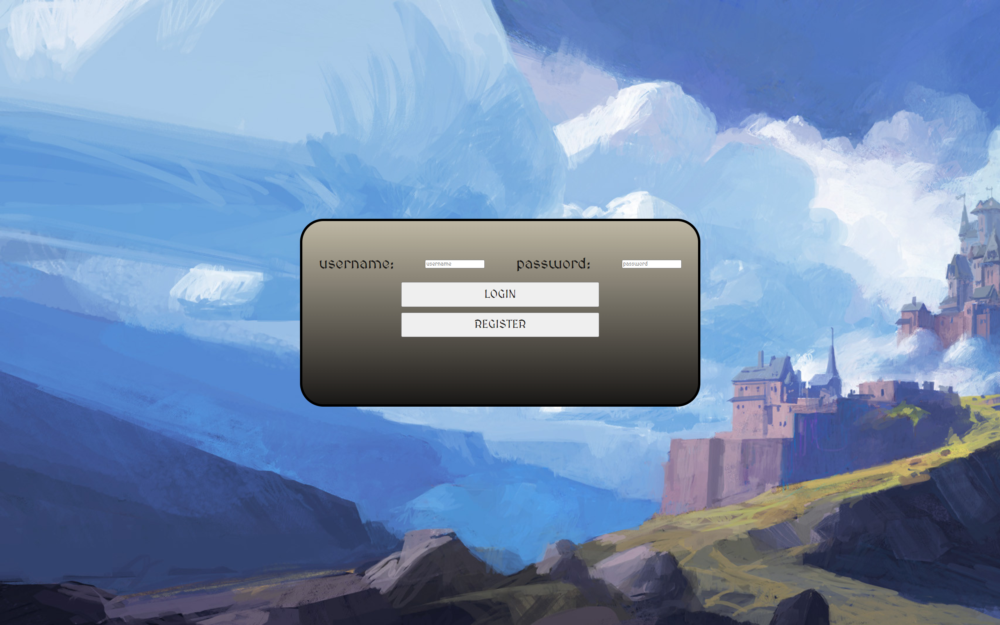
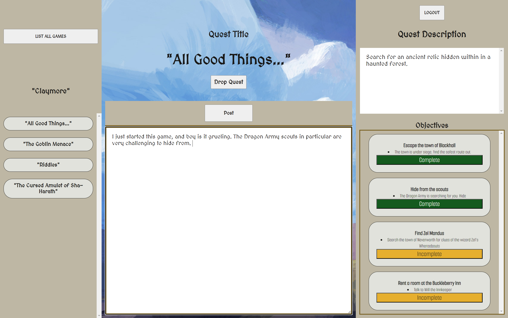

# Bragi Journal

## Summary

Bragi Journal is an application designed for gamers to be able to track their progress through a video game and their quest objectives.

-  Once a user selects a game, then they can select a quest and assign it to themselves.
- They can post notes in the journal about the quest. E.G. if they're struggling to complete a puzzle or a challenging portion of the game, they can write down ideas for solving that particular area.
- They can mark objectives complete for a quest.

## ERD

### 'users' Table

| Column Name | Data-type     | Description |
| :-------- | :------- | :-----------|
| `user_id`      | ` SERIAL PRIMARY KEY NOT NULL` | Primary Key
| `username` | `VARCHAR(255) NOT NULL` | username
| `password` | `VARCHAR(255) NOT NULL` | stored hashed password value

### 'games' Table

| Column Name | Data-type     | Description |
| :-------- | :------- | :-----------|
| `game_id`      | ` SERIAL PRIMARY KEY NOT NULL` | Primary Key
| `game_name` | `VARCHAR(255) NOT NULL` | game name

### 'quests' Table

| Column Name |Data-type    | Description |
| :-------- | :------- | :-----------|
| `quest_id`      | ` SERIAL PRIMARY KEY NOT NULL` | Primary Key
| `quest_title` | `VARCHAR(64) NOT NULL` | quest title
| `quest_description`      | `TEXT` | description of quest
| `game_id` | `INT NOT NULL` | foreign id of associated game from 'games' table

### 'quest_objectives' Table

| Column Name |Data-type    | Description |
| :-------- | :------- | :-----------|
| `quest_objective_id`      | ` SERIAL PRIMARY KEY NOT NULL` | Primary Key
| `objective_title` | `VARCHAR(64) NOT NULL` | title of objective
| `objective_description`      | `TEXT` | description of quest objective
| `quest_id` | `INT NOT NULL` | foreign id of associated quest from 'quests' table

### 'assigned_quests' Table

| Column Name |Data-type    | Description |
| :-------- | :------- | :-----------|
| `assigned_quest_id`      | ` SERIAL PRIMARY KEY NOT NULL` | Primary Key
| `completed` | `BOOLEAN DEFAULT FALSE` | Boolean marking if quest is completed or not
| `user_id`      | `INT NOT NULL` | foreign id of associated user from 'users' table
| `quest_id` | `INT NOT NULL` | foreign id of associated quest from 'quests' table

### 'assigned_objectives' Table

| Column Name |Data-type    | Description |
| :-------- | :------- | :-----------|
| `assigned_quest_objective_id`      | ` SERIAL PRIMARY KEY NOT NULL` | Primary Key
| `completed` | `BOOLEAN DEFAULT FALSE` | Boolean marking if quest is completed or not
| `assigned_quest_id`      | `INT NOT NULL` | foreign id of associated assigned quest from 'assigned_quests' table
| `quest_objective_id` | `INT NOT NULL` | foreign id of associated quest objective from 'quest_objectives' table

### 'journal' Table

| Column Name |Data-type    | Description |
| :-------- | :------- | :-----------|
| `post_id`      | ` SERIAL PRIMARY KEY NOT NULL` | Primary Key
| `content` | `TEXT` | Journal post content
| `user_id`      | `INT NOT NULL` | foreign id of associated user from 'users' table
| `assigned_quest_id` | `INT NOT NULL` | foreign id of associated assigned quest from 'assigned_quests' table

<h1> BRAGI ERD</h1>

<h1> BRAGI LOGIN</h1>

<h1> BRAGI MAIN </h1>

